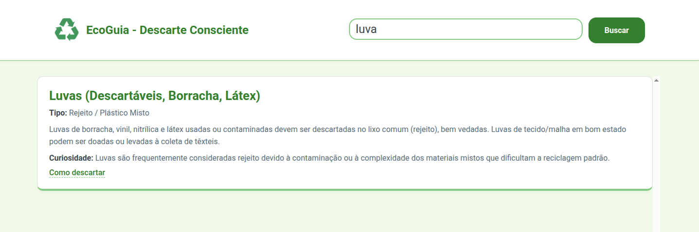
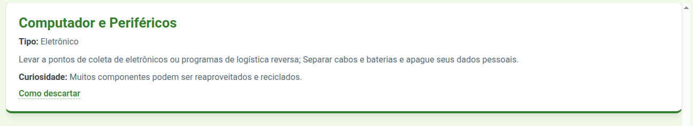

# 🌿 EcoGuia - Descarte Consciente

Uma aplicação web interativa que ensina como descartar corretamente diversos tipos de resíduos no Brasil, combinando **educação ambiental** e **praticidade**.

---

## ✨ Funcionalidades Principais

- **🔍 Busca Inteligente:** Pesquise qualquer resíduo (ex: pilhas, óleo de cozinha, fraldas) com normalização de acentos e letras maiúsculas/minúsculas.
- **📚 Base de Dados Completa:** Mais de 50 itens categorizados em Eletrônico, Perigoso, Orgânico, Plástico, Vidro e outros.
- **📝 Informações Detalhadas:** Cada item possui:
  - Nome: identificação do resíduo  
  - Tipo: classificação geral  
  - Descrição: instruções de preparo e descarte  
  - Curiosidade: informações sobre impacto ambiental ou composição  
  - Link de referência: pesquisa de pontos de coleta na região
- **📱 Interface Limpa e Responsiva:** Totalmente adaptável a desktops, tablets e celulares.
- **⚡ Leve e Minimalista:** Desenvolvido apenas com HTML, CSS e JavaScript puro, sem frameworks ou back-end complexo.

---

## 🌱 Impacto e Objetivo

O EcoGuia promove **consciência ambiental** e facilita o descarte correto de resíduos, ajudando a **reduzir a poluição**, incentivar a **reciclagem** e educar cidadãos sobre práticas sustentáveis.

---

## 🎯 Diferenciais do Projeto

- Funcionalidade de busca rápida e precisa  
- Foco em **educação ambiental no contexto brasileiro**  
- Interface limpa, moderna e acessível  
- Totalmente front-end, fácil de hospedar e compartilhar

---

## 💡 Como Usar

1. **Acesse a Aplicação:** [EcoGuia no GitHub Pages](https://gabrieldemoura9648.github.io/EcoGuia/)
2. **Pesquise o Item:** Digite o nome do resíduo na barra de busca.
3. **Visualize as Instruções:** Veja o tipo de resíduo, como descartá-lo corretamente e uma curiosidade relevante.
4. **Encontre Pontos de Coleta:** Clique no link "Como descartar" para pesquisar locais próximos.

---

## 🖼️ Capturas de Tela

*Barra de busca dinâmica mostrando os resultados filtrados em tempo real.*

*Card detalhado exibindo tipo do resíduo, instruções de descarte e curiosidade relevante.*

---

## 🛠 Tecnologias Utilizadas

- HTML5  
- CSS3  
- JavaScript (Vanilla)  
- GitHub Pages para hospedagem

---

## 🔗 Links Úteis

- Repositório GitHub: [https://github.com/GabrieldeMoura9648/EcoGuia](https://github.com/GabrieldeMoura9648/EcoGuia)  
- Projeto Online: [https://gabrieldemoura9648.github.io/EcoGuia/](https://gabrieldemoura9648.github.io/EcoGuia/)

  
